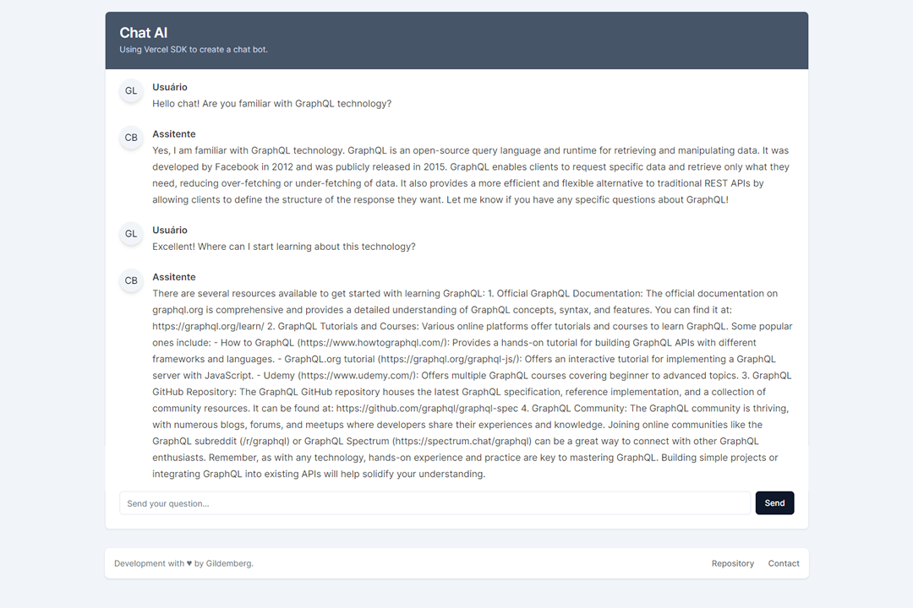

# Chat AI

[](https://openai.com/)
[](https://vercel.com/)
[](https://nextjs.org/)
[](https://tailwindcss.com/)
[](https://shadcn/ui)

Chat AI is a project that utilizes the OpenAI API along with the Vercel SDK, developed using Next.js. It allows interacting with ChatGPT 3.5 Turbo, an advanced language model provided by OpenAI, to create conversations and obtain intelligent and contextual responses.



## How to Use

1. Clone the `chat-ai` repository:

```bash
git clone https://github.com/gildembergleite/chat-ai.git
```

2. Access the project directory:

```bash
cd chat-ai
```

3. Install the dependencies:

```bash
npm install
```

4. Run the project locally:

```bash
npm run dev
```

Now, you can access the application at `http://localhost:3000`.

## Dependencies

Make sure you have the following dependency versions installed:

```json
"dependencies": {
  "@radix-ui/react-avatar": "^1.0.3",
  "@radix-ui/react-slot": "^1.0.2",
  "@types/node": "20.4.2",
  "@types/react": "18.2.15",
  "@types/react-dom": "18.2.7",
  "ai": "^2.1.21",
  "autoprefixer": "10.4.14",
  "class-variance-authority": "^0.6.1",
  "clsx": "^2.0.0",
  "eslint": "8.45.0",
  "eslint-config-next": "13.4.10",
  "install": "^0.13.0",
  "lucide-react": "^0.260.0",
  "next": "13.4.10",
  "openai-edge": "^1.2.0",
  "postcss": "8.4.26",
  "react": "18.2.0",
  "react-dom": "18.2.0",
  "tailwind-merge": "^1.14.0",
  "tailwindcss": "3.3.3",
  "tailwindcss-animate": "^1.0.6",
  "typescript": "5.1.6"
},
```

## Contribution

Feel free to contribute to this project by opening issues and pull requests. All contributions are welcome!

## License

This project is licensed under the MIT License - see the [LICENSE](LICENSE) file for details.

---

Created by [gildembergleite](https://github.com/gildembergleite) with ❤️ using technologies from OpenAI, Vercel SDK, Next.js, Tailwind CSS, and shadcn/ui.